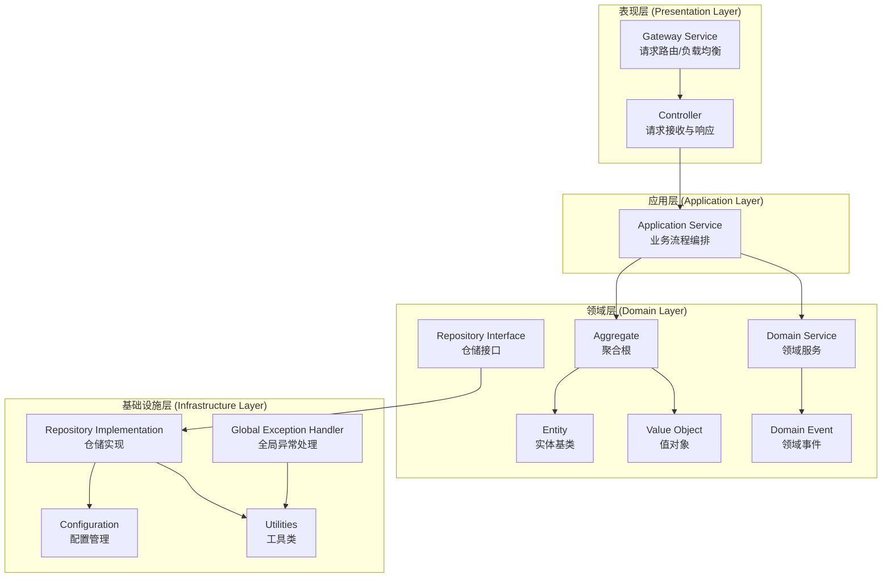
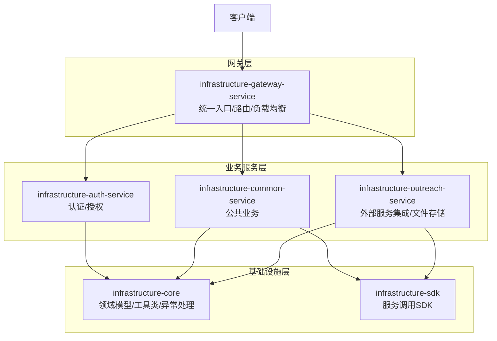
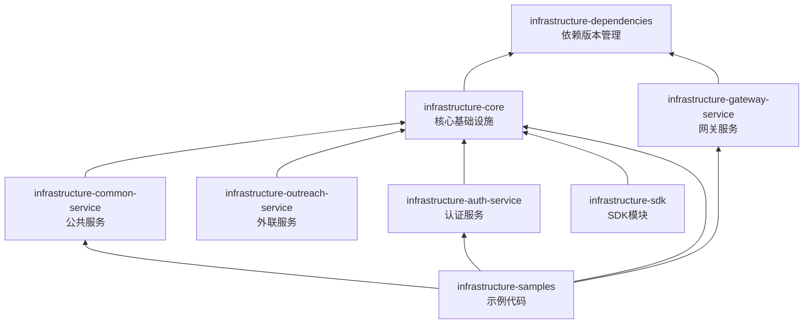

# Infrastructure 基础设施底座

企业级 B 端项目基础设施底座，基于 Spring Boot 3.3 + Spring Cloud 2023 构建，提供网关、公共服务、外联服务、认证服务等核心能力。

## 技术栈

- **Java**: 21
- **Spring Boot**: 3.3.7
- **Spring Cloud**: 2023.0.5
- **数据库**: MySQL 8.0.33
- **ORM**: Spring Data JPA + Hibernate 5.6.15.Final
- **构建工具**: Maven
- **其他工具**: Lombok 1.18.36, MapStruct 1.5.5.Final, Hutool 5.8.26, Jackson

## 依赖版本说明

| 依赖名称 | GroupId | ArtifactId | 版本 | 说明 |
|---------|---------|------------|------|------|
| Spring Boot | org.springframework.boot | spring-boot-dependencies | 3.3.7 | 核心框架 |
| Spring Cloud | org.springframework.cloud | spring-cloud-dependencies | 2023.0.5 | 微服务组件 |
| Hutool | cn.hutool | hutool-all | 5.8.26 | Java工具库 |
| Lombok | org.projectlombok | lombok | 1.18.36 | 注解处理器 |
| MapStruct | org.mapstruct | mapstruct | 1.5.5.Final | 对象映射 |
| Commons Lang3 | org.apache.commons | commons-lang3 | 3.14.0 | 语言工具 |
| MySQL Connector | mysql | mysql-connector-j | 8.0.33 | 数据库驱动 |
| Hibernate Core | org.hibernate | hibernate-core | 5.6.15.Final | ORM框架 |
| X-File-Storage | org.dromara.x-file-storage | x-file-storage-spring | 2.2.2 | 文件存储 |
| 阿里云 OSS SDK | com.aliyun.oss | aliyun-sdk-oss | 3.17.3 | 云存储 |

## 整体架构

### DDD 分层架构



### 微服务架构



### 模块依赖关系



## 项目结构

```
infrastructure-parent/
├── infrastructure-dependencies/    # 依赖版本管理
├── infrastructure-core/            # 核心模块（领域模型、工具类、异常处理）
├── infrastructure-common-service/  # 公共服务
├── infrastructure-gateway-service/ # 网关服务
├── infrastructure-outreach-service/ # 外联服务
├── infrastructure-auth-service/    # 认证服务
├── infrastructure-sdk/             # SDK 模块
│   ├── infrastructure-sdk-common/  # 公共 SDK
│   └── infrastructure-sdk-outreach/ # 外联 SDK
└── infrastructure-samples/         # 示例代码
```

## 核心模块说明

### 1. infrastructure-dependencies

统一管理所有依赖版本，确保项目依赖一致性。

### 2. infrastructure-core

核心基础设施模块，提供以下能力：

- **领域模型基类**
  - [AbstractEntity](file:///workspace/infrastructure-core/src/main/java/com/tyrone/infrastructure/core/domain/AbstractEntity.java) - 实体基类，包含审计字段（创建时间、更新时间、创建人、更新人）、逻辑删除标识和版本号
  - [AbstractRequest](file:///workspace/infrastructure-core/src/main/java/com/tyrone/infrastructure/core/domain/AbstractRequest.java) - 请求基类
  - [AbstractResponse](file:///workspace/infrastructure-core/src/main/java/com/tyrone/infrastructure/core/domain/AbstractResponse.java) - 响应基类
  - [DomainEvent](file:///workspace/infrastructure-core/src/main/java/com/tyrone/infrastructure/core/domain/DomainEvent.java) - 领域事件基类

- **统一响应格式**
  - [Response](file:///workspace/infrastructure-core/src/main/java/com/tyrone/infrastructure/core/pl/Response.java) - 统一响应包装类
  - [GlobalResponseCode](file:///workspace/infrastructure-core/src/main/java/com/tyrone/infrastructure/core/enums/GlobalResponseCode.java) - 全局响应码枚举

- **工具类**
  - [JsonUtil](file:///workspace/infrastructure-core/src/main/java/com/tyrone/infrastructure/core/util/JsonUtil.java) - JSON 工具类，支持对象与 JSON 互转

- **异常处理**
  - [ApplicationException](file:///workspace/infrastructure-core/src/main/java/com/tyrone/infrastructure/core/exception/ApplicationException.java) - 应用异常类

### 3. infrastructure-common-service

公共服务模块，提供：

- [GlobalExceptionHandler](file:///workspace/infrastructure-common-service/src/main/java/com/tyrone/infrastructure/common/exception/GlobalExceptionHandler.java) - 全局异常处理器
- 数据库访问能力
- 公共业务能力

### 4. infrastructure-gateway-service

网关服务，负责：

- 请求路由
- 负载均衡
- 统一入口

### 5. infrastructure-outreach-service

外联服务，提供：

- 外部服务调用封装
- 文件存储能力（集成 x-file-storage 和阿里云 OSS）

### 6. infrastructure-auth-service

认证服务，提供：

- 用户认证
- 权限管理

### 7. infrastructure-sdk

SDK 模块，提供各服务的客户端调用能力：

- infrastructure-sdk-common - 公共 SDK
- infrastructure-sdk-outreach - 外联服务 SDK

### 8. infrastructure-samples

示例代码，包含：

- sample-common-service - 公共服务示例
- sample-spring-cloud-gateway - 网关示例
- sample-spring-authorization-server - 认证服务器示例

## 快速开始

### 环境要求

- JDK 21+
- Maven 3.8+
- MySQL 8.0+

### 构建项目

```bash
mvn clean install
```

### 配置说明

公共服务配置示例（[application.yml](file:///workspace/infrastructure-common-service/src/main/resources/application.yml)）：

```yaml
server:
  port: ${SERVER_PORT:8082}
  servlet:
    context-path: ${CONTEXT_PATH:/common}

spring:
  application:
    name: infrastructure-common-service
  datasource:
    url: ${DB_URL:jdbc:mysql://localhost:3306/test?useSSL=false&serverTimezone=GMT%2B8&allowPublicKeyRetrieval=true}
    username: ${DB_USER:root}
    password: ${DB_PASSWORD:}
```

所有配置支持环境变量覆盖，便于容器化部署。

## 核心特性

### 1. 统一响应格式

所有接口返回统一的 [Response](file:///workspace/infrastructure-core/src/main/java/com/tyrone/infrastructure/core/pl/Response.java) 格式：

```java
// 成功响应
Response.success(data);

// 失败响应
Response.fail(GlobalResponseCode.SYSTEM_ERROR);
```

### 2. 全局异常处理

[GlobalExceptionHandler](file:///workspace/infrastructure-common-service/src/main/java/com/tyrone/infrastructure/common/exception/GlobalExceptionHandler.java) 统一处理各类异常，返回标准化的错误响应。

### 3. 实体审计

[AbstractEntity](file:///workspace/infrastructure-core/src/main/java/com/tyrone/infrastructure/core/domain/AbstractEntity.java) 提供自动审计功能：

- createTime / updateTime - 创建/更新时间
- createBy / updateBy - 创建/更新人
- deleted - 逻辑删除标识
- version - 乐观锁版本号

### 4. 预定义响应码

[GlobalResponseCode](file:///workspace/infrastructure-core/src/main/java/com/tyrone/infrastructure/core/enums/GlobalResponseCode.java) 提供丰富的预定义响应码：

- 000000 - 成功
- 100001 - 系统错误
- 100002 - 参数错误
- 200001 - 未授权
- 300001 - 资源不存在
- ...

## 开发指南

### 添加新模块

1. 在根目录 [pom.xml](file:///workspace/pom.xml) 的 `<modules>` 中添加新模块
2. 创建模块目录并配置 pom.xml，继承 infrastructure-parent
3. 根据需要依赖 infrastructure-core

### 使用基础设施能力

```java
// 1. 继承 AbstractEntity
@Entity
public class User extends AbstractEntity {
    // ...
}

// 2. 使用统一响应
@GetMapping("/users")
public Response<List<User>> getUsers() {
    return Response.success(userService.findAll());
}

// 3. 抛出业务异常
throw new ApplicationException(GlobalResponseCode.NOT_FOUND);
```

## 许可证

详见 [LICENSE](file:///workspace/LICENSE) 文件。
